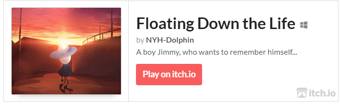
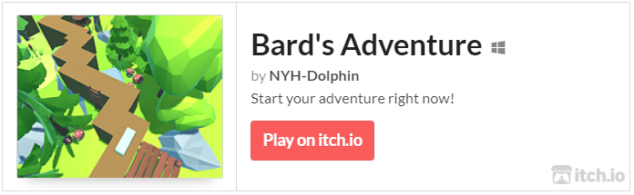

# 
Dolphin NIE

## Introduction
- 👩‍💻 Game Innovation Lab @ NYU \[Research on Game AI | Procedural Content Generation\]
- 🏫 M.S. in IDM @ NYU Tandon (focuing on enterntainment technology from Computer Science + Game Center) 
- 🏫 B.Eng. in Computer Science and Technology @ SUSTech  
- 🤔 Game Dev, VR/AR/MR, Game Artificial Intelligence, Computer Graphic, HCI, Interaction
- 🙂 I like playing games and watching Japanese animations~ Feel free to DM with me with the related topic

## Publication
- **\[IEEE CoG 2023 Best Paper\]** **Nie, Y**., Zheng, S., Zhuang, Z., & Song, X. (2023). Extend Wave Function Collapse to Large-Scale Content Generation. arXiv preprint arXiv:2308.07307.
- **\[IJHCI 2023\]** Mu, R., **Nie, Y.**, Cao, K., You, R., Wei, Y., & Tong, X. (2023). Pilgrimage to Pureland: Art, Perception and the Wutai Mural VR Reconstruction. arXiv preprint arXiv:2304.07511.
- **\[Patent\]** Song, X., **Nie, Y.**, Zhang, H., Zhuang, Z. (2023). Methods, devices, servers and storage for obtaining the close contact's information

## Projects & Games

Try my games at https://nyh-dolphin.itch.io/

## Stats
 

